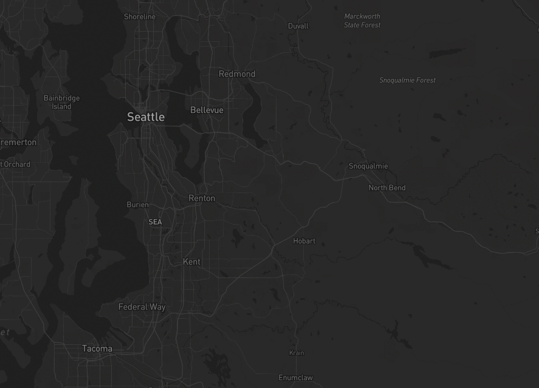
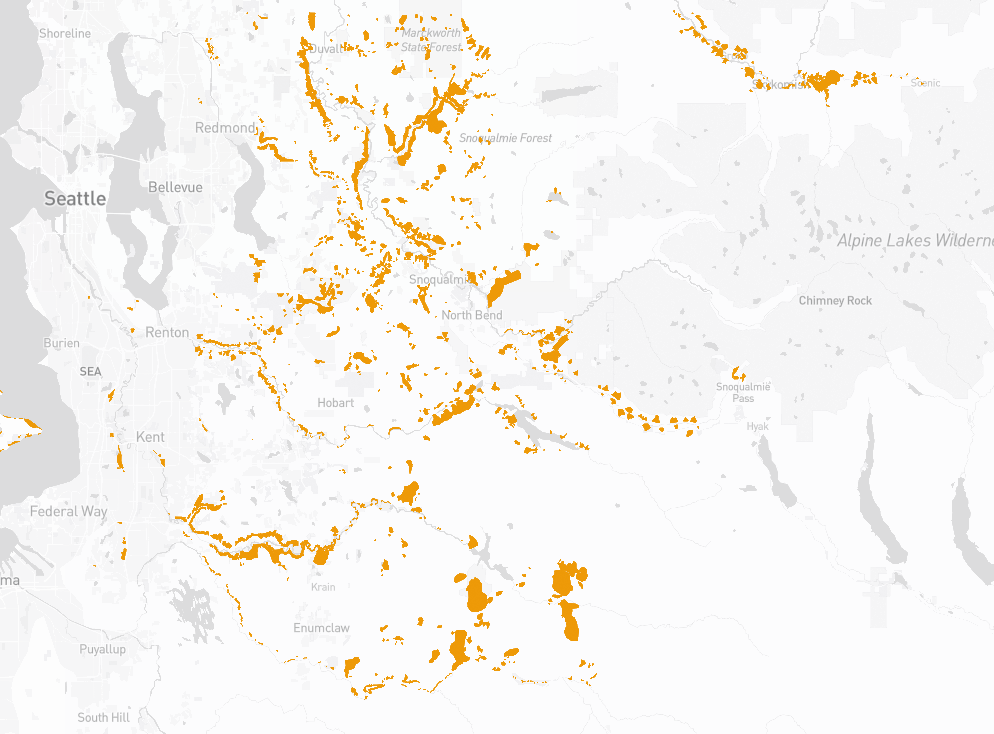
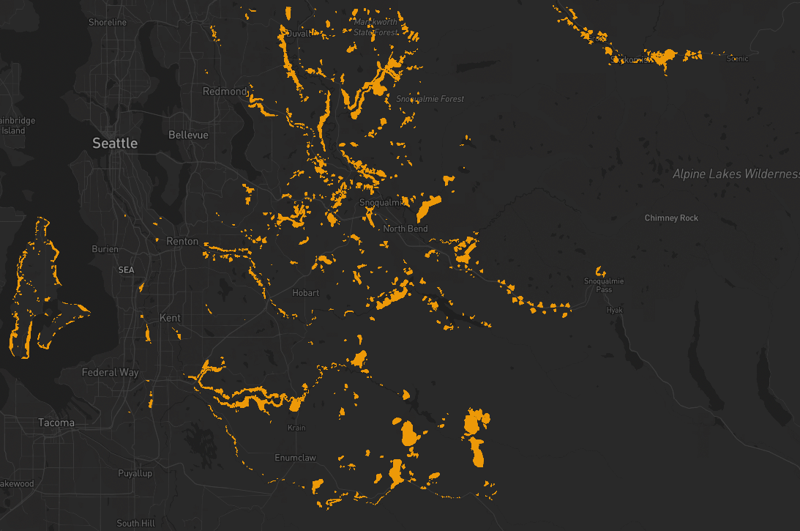
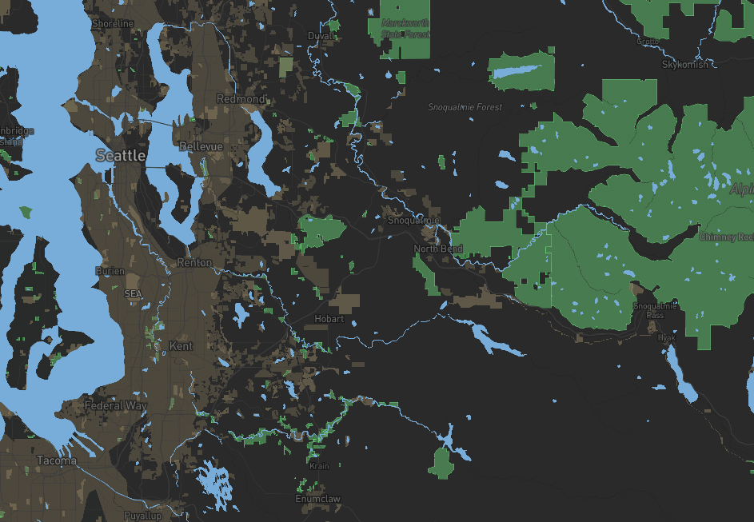

# Lab 4: Map Design with Map Tiles
Mitchell Stapelman

Github pages: https://stpme.github.io/lab4-map-design/
## Description
For this project, I used [landslide hazard data](https://gis-kingcounty.opendata.arcgis.com/datasets/kingcounty::potential-landslide-hazard-areas-2016-landslide-hazard-area/explore?location=47.499796%2C-121.770961%2C9.67) from King County to create map tiles displaying areas at risk of landslides across the county. Mapbox and QGIS were used to generate the map tiles and basemap. The zoom levels for each tile ranges from 0-10, starting at 9 to focus on the entire county/region.
## Map Layers
### Map 1: Basemap 
Simple basemap of King County.
### Map 2: Landslide data 
Data showing areas at risk of landslides/hazard.
### Map 3: Basemap and Data 
Combined map showing basemap and landslide data.
### Map 4: Land Feature Theme
This map theme highlights national parks in green, bodies of water in blue and areas of high land use in brown to show high population areas. These topographical factors can be used to contextualize the impact of landslides in the area.
